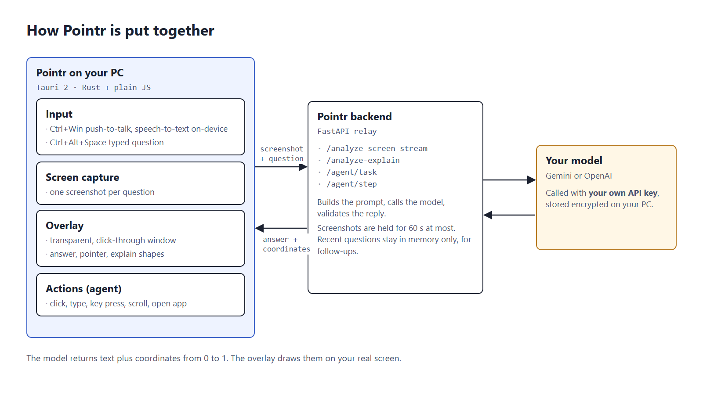

<div align="center">
  

  # Pointr

  ### Ask your screen anything.

  *A Windows overlay that sees what's on your screen, answers in place, and can act on your behalf — with your permission, every time.*

  [](LICENSE)
  [](https://github.com/satvikydv/pointr/releases/latest)
  [](https://tauri.app)
  [](backend)
  [-8b5cf6)](#bring-your-own-key)

  [Website](https://www.pointr.duckdns.org) · [Setup Guide](https://www.pointr.duckdns.org/setup.html) · [Privacy](https://www.pointr.duckdns.org/privacy.html) · [Releases](https://github.com/satvikydv/pointr/releases) · [Issues](https://github.com/satvikydv/pointr/issues)
</div>

<p align="center">
  
</p>

---

## What it does

Press `Ctrl+Alt+Space` anywhere on Windows. Pointr captures your screen, marks exactly where your cursor is, and answers whatever you type — in place, with a pointer to what it's talking about. Ask `agent: <task>` and it can act for you: type into a focused field, open an app, click through a multi-step task across windows and a real browser. By default it shows what it's about to do and waits for Enter; Settings → On-screen actions can switch that to "Always allow" (no prompt, Esc still stops it) or "Off".

- **Direct Q&A** — hotkey, ask, get an answer anchored to a point on screen. No region-select step required.
- **Push-to-talk voice** — hold `Ctrl+Win`, speak, let go. Speech is transcribed on-device (NVIDIA Parakeet, one-time download) while you're still talking, so the question is sent the instant you release. Audio never leaves your machine.
- **`explain: <topic>`** — a narrated, drawn-on-screen walkthrough instead of a wall of text.
- **`agent: <task>`** — one confirmed action (type a reply, open an app) or a full autonomous multi-step run, with a live step trace and a History window to review past runs.
- **Browser automation** — a local Playwright-driven browser for tasks that need one, clicking by accessibility role/name instead of guessed pixel coordinates.
- **Tool-using agent** — reads your GitHub repos/issues/PRs (read-only), searches the live web (Tavily), and reads local files including PDFs, all opt-in and configured per-user.
- **Narration** — offline, local Windows text-to-speech; no cloud call, no extra cost.
- **Session memory** — a short-lived, per-app conversation history so follow-up questions have context.

## Bring your own key

Pointr doesn't run on a shared, metered backend. Connect a [Gemini](https://aistudio.google.com) key, an [OpenAI](https://platform.openai.com/api-keys) key, or both, in Settings — every request runs on your own key, nothing shared. Pick any model either provider gives you: the model list is fetched live from your key (filtered to whatever can actually read a screenshot), plus a free-text box for any model ID at all. Switch providers or models anytime; every feature works identically on either one.

## Install

Download the latest Windows installer from **[Releases](https://github.com/satvikydv/pointr/releases/latest)**, run it, and connect an API key in Settings — see the **[setup guide](https://www.pointr.duckdns.org/setup.html)** for the two-minute walkthrough. The installer talks to Pointr's hosted backend by default; nothing else to run.

Requires 64-bit Windows 10 (1903 or later) or Windows 11, plus the Microsoft Visual C++ Redistributable, which most PCs already have. If Pointr won't start and mentions a missing `MSVCP140.dll` or `VCRUNTIME140.dll`, install the [x64 redistributable](https://aka.ms/vs/17/release/vc_redist.x64.exe) and try again.

## Build from source

Pointr is two pieces: a Tauri (Rust) desktop client, and a FastAPI + Celery backend it talks to. You can run both locally against your own backend instead of the hosted one.

**Desktop client** (`app/`)
```powershell
cd app
npm install
npm run tauri dev
```

**Backend** (`backend/`, via Docker Compose)
```powershell
# root .env needs at minimum:
#   GEMINI_API_KEY=...   (or leave blank and add a key in Settings instead)
docker compose up -d
```

By default the client build targets `http://localhost:8000` — set `POINTR_ENV=prod` in the root `.env` to build against a hosted backend instead (see [`app/src-tauri/build.rs`](app/src-tauri/build.rs)).

**Requirements:** Rust (stable) + the Tauri prerequisites for Windows, Node.js (client build, and lazily for browser-automation tasks at runtime), Docker (backend).

## Architecture

<p align="center">
  
</p>

The backend is a relay, not a store: screenshots, queries and answers pass through per request and aren't retained. See [Privacy](https://www.pointr.duckdns.org/privacy.html) for exactly what's kept, for how long, and why.

## Privacy & telemetry

Usage telemetry is **opt-in, off by default**, asked once. It's anonymous (a random install ID, no account) and never includes screenshots, queries, file contents, answers, or tokens — only which features get used and whether a request failed. Full details: [privacy page](https://www.pointr.duckdns.org/privacy.html).

## Contributing

Issues and PRs welcome. There's no formal contributing guide yet — open an issue for anything non-trivial before sending a large PR, so the approach can be agreed on first.

## License

[GNU AGPLv3](LICENSE).
